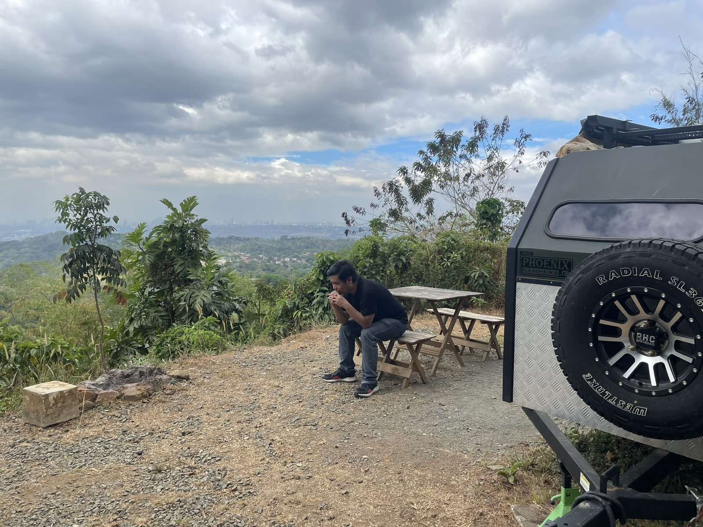
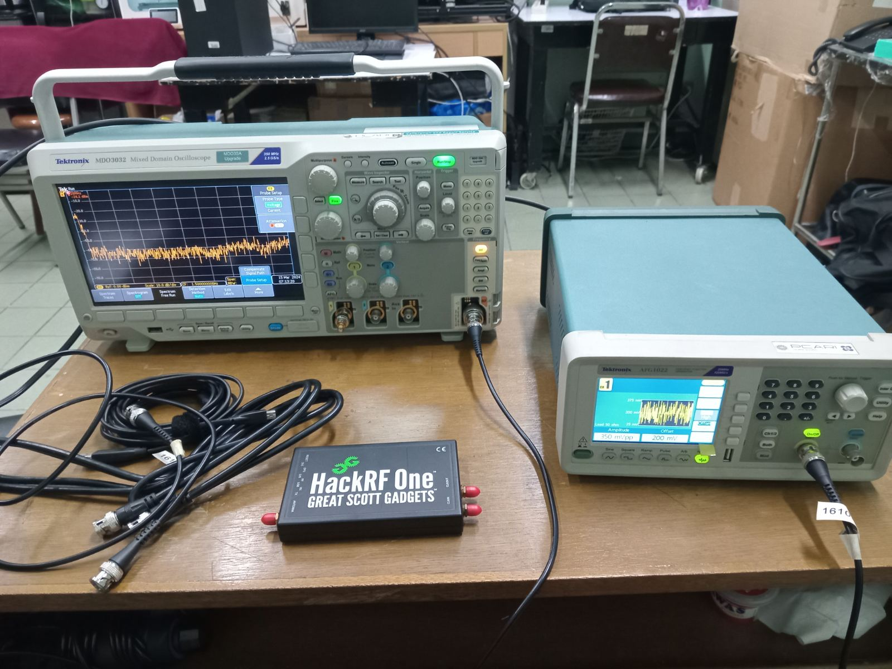

> "Sapiens qui prospicit" - Personal Mantra

<justify> Hello, and welcome to my website! I’m Rizchel, an MSc Physics (candidate) dedicated to exploring the universe under radio frequency! I'm a former artificial intelligence officer and currently a data-driven astrophysics advocate. </justify>

 *Literally me overthinking about overthinking* 

<justify> I'm sharing more of my professional and academic background on this website. I will also showcase some of the work I have been doing and am currently working on, including my academic and professional endeavors. I'd like you to please join me on this journey, and feel free to contact me with any questions or comments. All of my socials can be found below my profile picture. </justify>

 My initial measurement procedures (attempts only) 

 
Top Blog Posts:  
[Why Physics is for Anyone?](https://ko-fi.com/i/IP5P2UTAG1)  
[Lessons that We Can Learn from Failure](https://ko-fi.com/post/Lesson-that-we-can-learn-from-failure-G2G4UWF8J)  
[On Carefully Selecting your Research Adviser](https://ko-fi.com/post/On-Carefully-Selecting-your-Research-Adviser-C0C1V5ZXK)  
[Why We Need More Scientists in the Philippines?](https://ko-fi.com/post/Why-We-Need-More-Scientists-in-the-Philippines-S6S0VK8S8)  
[The Route to Normal Science](https://ko-fi.com/post/The-Route-to-Normal-Science-G2G1VVXFB)  

 
Interviews and Public Lectures:  
[Interview: Radio Active](https://issuu.com/theappulse/docs/the-appulse-special-edition-2018)
[Public Lecture: Connecting the Dots part 1](https://ms-my.facebook.com/PhilippineAstronomicalSociety/videos/connection-a-pas-monthly-lectureconnecting-the-dots-and-why-it-mattersby-rizchel/3037140526357955/)  
[Public Lecture: Connecting the Dots part 2](https://www.facebook.com/PhilippineAstronomicalSociety/videos/connection-a-pas-monthly-lectureconnecting-the-dots-and-why-it-mattersby-rizchel/492818724890957/)  
[More of Rizchel Masong](https://pinoyscientists.tumblr.com/post/163635780595/meet-rizchel-masong-physicist-1-what-do-you#notes)  
