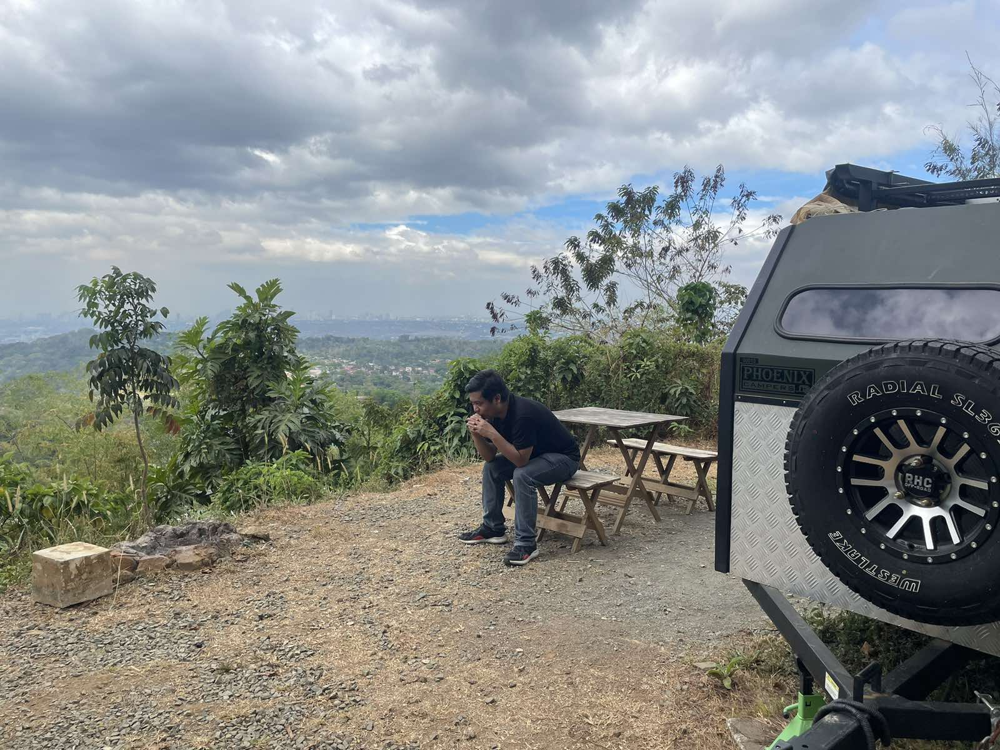
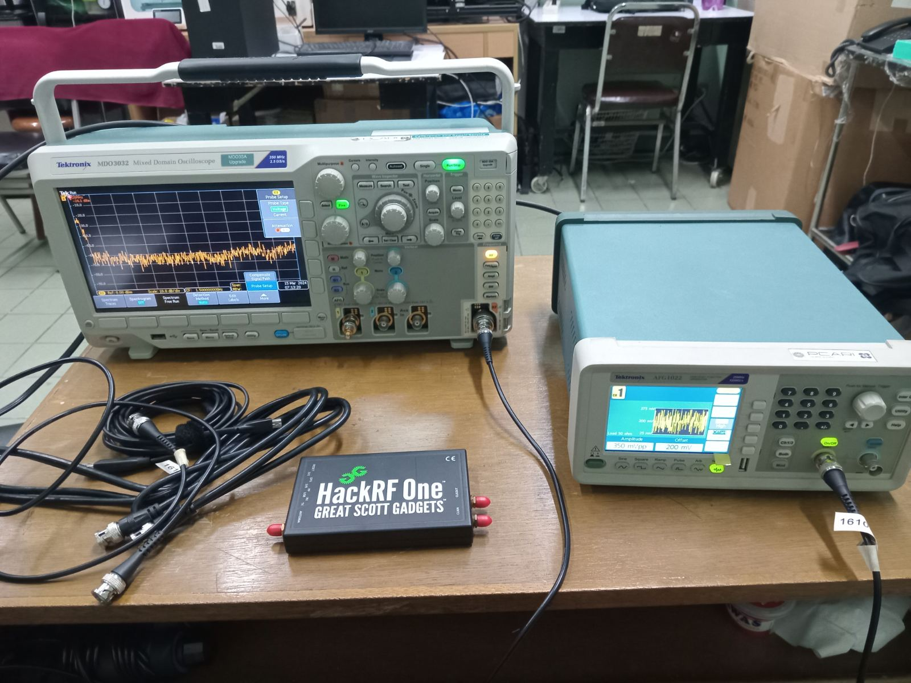

> "Sapiens qui prospicit" - Personal Mantra

 
<justify> Hello, and welcome to my website! I'm Rizchel, an astrophysicist and data scientist. I'm an Artificial Intelligence Projects Executive and currently a data-driven advocate for astrophysics. </justify>
 

 
<justify> Beyond my academic/research background, I'm the incoming interim CEO of Quant⟨AI⟩, a startup company focusing on AI solutions. While materializing this venture, I’m a Lead AI/ Astrophysics Education Program Consultant and AI Automation and Workflow Specialist. I’m also an aspiring Stand-Up Comedian.
 
</justify>

 

 *Literally me overthinking about overthinking* 

 

<justify> I'm sharing more of my professional and academic background on this website. I will also showcase some of the work I have been doing and am currently working on, including my educational and professional endeavors. Please join me on this journey by following my regular blog posts on Ko-fi, and feel free to contact me with any questions. You can find all my social media links below my profile picture. </justify>
 

 My initial measurement procedures (attempts only) 

 
Top Blog Posts:  
[Personal Notes: 🌱 The 7 Habits of Highly Effective People](https://masongrizchel.notion.site/Personal-Notes-The-7-Habits-of-Highly-Effective-People-203ef9e093278000a5cdc983c59f36c1?source=copy_link)  
[Lessons Learned from James Clear's Atomic Habits](https://masongrizchel.notion.site/Lessons-Learned-from-James-Clear-s-Atomic-Habits-203ef9e093278091a6b9e13add27df0e?source=copy_link)  
[Some Notable Lessons from Kadavy's Mind Management](https://masongrizchel.notion.site/Some-Notable-Lessons-from-Kadavy-s-Mind-Management-203ef9e093278052a746f65d40482b47?source=copy_link)  
[Lessons that We Can Learn from Failure](https://ko-fi.com/post/Lesson-that-we-can-learn-from-failure-G2G4UWF8J)  
[On Carefully Selecting your Research Adviser](https://ko-fi.com/post/On-Carefully-Selecting-your-Research-Adviser-C0C1V5ZXK)  
[Why We Need More Scientists in the Philippines?](https://ko-fi.com/post/Why-We-Need-More-Scientists-in-the-Philippines-S6S0VK8S8)  
[The Route to Normal Science](https://ko-fi.com/post/The-Route-to-Normal-Science-G2G1VVXFB)  

Interviews and Public Lectures:  
[AI Applications on STEM Research](https://www.facebook.com/reel/1646208462708925)  
[Interview: Radio Active](https://issuu.com/theappulse/docs/the-appulse-special-edition-2018)  
[Public Lecture: Connecting the Dots part 1](https://ms-my.facebook.com/PhilippineAstronomicalSociety/videos/connection-a-pas-monthly-lectureconnecting-the-dots-and-why-it-mattersby-rizchel/3037140526357955/)  
[Public Lecture: Connecting the Dots part 2](https://www.facebook.com/PhilippineAstronomicalSociety/videos/connection-a-pas-monthly-lectureconnecting-the-dots-and-why-it-mattersby-rizchel/492818724890957/)  
[More of Rizchel Masong](https://pinoyscientists.tumblr.com/post/163635780595/meet-rizchel-masong-physicist-1-what-do-you#notes)  
